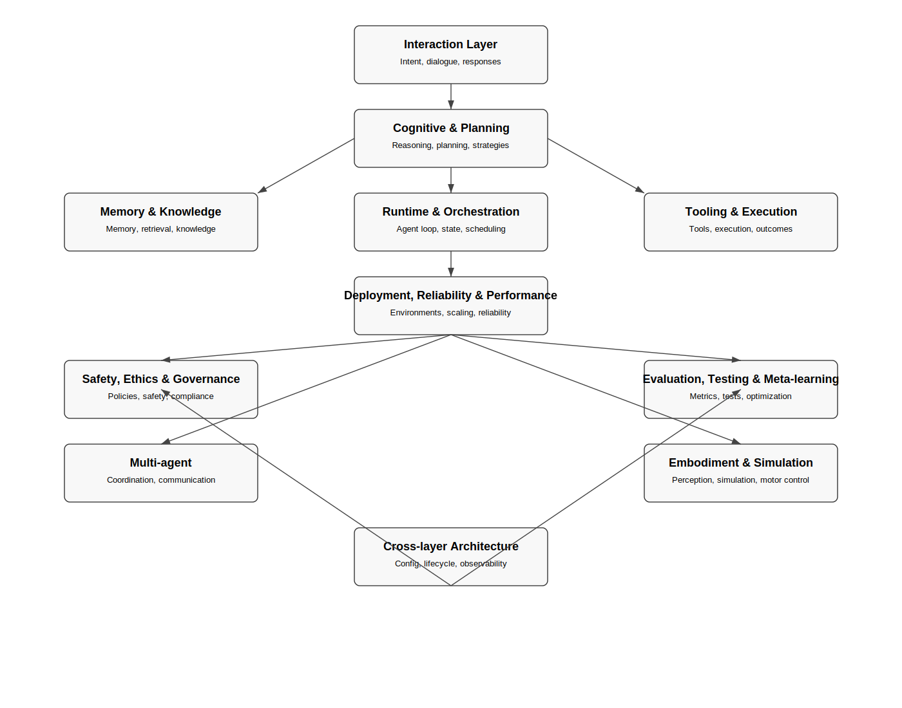

[](https://github.com/krunixbase/agent-ai-lab/releases)


<!-- TOC START -->
- [Agent AI Lab — System Architecture Documentation](#agent-ai-lab--system-architecture-documentation)
  - [Architecture Overview](#architecture-overview)
  - [Table of Contents](#table-of-contents)
  - [Full Documentation Index](#full-documentation-index)
  - [Layer Documentation](#layer-documentation)
    - [1. Interaction Layer](#1-interaction-layer)
    - [2. Cognitive & Planning Layer](#2-cognitive--planning-layer)
    - [3. Memory & Knowledge Layer](#3-memory--knowledge-layer)
    - [4. Tooling & Execution Layer](#4-tooling--execution-layer)
    - [5. Runtime & Orchestration Layer](#5-runtime--orchestration-layer)
    - [6. Safety, Ethics & Governance Layer](#6-safety-ethics--governance-layer)
    - [7. Deployment, Reliability & Performance Layer](#7-deployment-reliability--performance-layer)
    - [8. Evaluation, Testing & Meta-learning Layer](#8-evaluation-testing--meta-learning-layer)
    - [9. Multi-agent Layer](#9-multi-agent-layer)
    - [10. Embodiment & Simulation Layer](#10-embodiment--simulation-layer)
    - [11. Cross-layer Architecture](#11-cross-layer-architecture)
    - [12. Backup & Migration Logs](#12-backup--migration-logs)
  - [Repository Structure](#repository-structure)
  - [Goals of the Documentation](#goals-of-the-documentation)
  - [Migration Notes](#migration-notes)
  - [Contributing](#contributing)
  - [License](#license)
  - [Acknowledgements](#acknowledgements)
<!-- TOC END -->

# Agent AI Lab — System Architecture Documentation

This repository contains a comprehensive, modular, and deeply structured documentation set describing the full architecture of an advanced AI agent system. The goal of the project is to provide a clear, layered, and extensible blueprint for building, evaluating, and deploying intelligent agents capable of reasoning, interacting, learning, and acting safely in complex environments.

The documentation is organized into well-defined architectural layers, each representing a major subsystem of the agent. Every layer includes conceptual overviews, detailed specifications, observability models, safety considerations, and cross‑layer dependencies.

---

## Architecture Overview


Below is a high-level diagram of the full agent architecture:
=======
## Table of Contents
- [Architecture Overview](#architecture-overview)
- [Architecture Diagram](#architecture-overview)

---

## Full Documentation Index

For a complete list of all architecture documents across all layers, see:

👉 **[Global Architecture Index](docs/architecture/INDEX.md)**
- [Repository Structure](#repository-structure)

---

## Layer Documentation

- **Interaction Layer**  
  docs/architecture/interaction/README.md

- **Cognitive & Planning Layer**  
  docs/architecture/cognitive-planning/README.md

- **Memory & Knowledge Layer**  
  docs/architecture/memory-knowledge/README.md

- **Tooling & Execution Layer**  
  docs/architecture/tooling-execution/README.md

- **Runtime & Orchestration Layer**  
  docs/architecture/runtime-orchestration/README.md

- **Safety, Ethics & Governance Layer**  
  docs/architecture/safety-ethics-governance/README.md

- **Deployment, Reliability & Performance Layer**  
  docs/architecture/deployment-reliability-performance/README.md

- **Evaluation, Testing & Meta-learning Layer**  
  docs/architecture/evaluation-testing-meta-learning/README.md

- **Multi-agent Layer**  
  docs/architecture/multi-agent/README.md

- **Embodiment & Simulation Layer**  
  docs/architecture/embodiment-simulation/README.md

- **Cross-layer Architecture**  
  docs/architecture/cross-layer/README.md

- **Backup & Migration Logs**  
  docs/architecture/_backup/
- [Goals of the Documentation](#goals-of-the-documentation)
- [Migration Notes](#migration-notes)
- [Contributing](#contributing)
- [License](#license)
- [Acknowledgements](#acknowledgements)
- [Full Documentation Index](#full-documentation-index)
- [Layer Documentation](#layer-documentation)
**agent-ai-lab** provides a clean foundation for experimenting with AI agents powered by LLMs.  
The project focuses on:
>>>>>>> 2f288d3 (Full automated documentation update (TOC, links, related docs))



The system architecture is divided into twelve major layers:

### 1. Interaction Layer
Manages communication between the agent and the user, including intent interpretation, dialogue management, response generation, and conversational safety.

### 2. Cognitive & Planning Layer
Responsible for reasoning, decision-making, long‑horizon planning, meta‑reasoning, and cognitive strategies.

### 3. Memory & Knowledge Layer
Handles episodic, semantic, and working memory; knowledge representation; retrieval pipelines; and memory safety.

### 4. Tooling & Execution Layer
Defines how the agent selects, validates, sequences, and executes tools and external actions.

### 5. Runtime & Orchestration Layer
Controls the agent’s execution loop, state management, concurrency, scheduling, and error handling.

### 6. Safety, Ethics & Governance Layer
Ensures safe, ethical, compliant, and policy‑aligned behavior across all agent operations.

### 7. Deployment, Reliability & Performance Layer
Covers deployment models, scaling, environment configuration, reliability engineering, and performance optimization.

### 8. Evaluation, Testing & Meta-learning Layer
Provides evaluation frameworks, regression testing, benchmarking, and self‑optimization mechanisms.

### 9. Multi-agent Layer
Supports communication, coordination, and governance in multi‑agent systems.

### 10. Embodiment & Simulation Layer
Models perception, motor control, simulation environments, and embodied agent behavior.

### 11. Cross-layer Architecture
Defines global mechanisms such as configuration, versioning, lifecycle management, and system-wide observability.

### 12. Backup & Migration Logs
Contains backup copies of all documents and logs from automated migration scripts.

---

## Repository Structure

```
docs/
└── architecture/
├── interaction/
├── cognitive-planning/
├── memory-knowledge/
├── tooling-execution/
├── runtime-orchestration/
├── safety-ethics-governance/
├── deployment-reliability-performance/
├── evaluation-testing-meta-learning/
├── multi-agent/
├── embodiment-simulation/
├── cross-layer/
├── _backup/
├── move.log
└── move2.log
```

Each folder contains a dedicated `README.md` describing the purpose of the layer and indexing all documents within it.

---

## Goals of the Documentation

- Provide a complete architectural blueprint for advanced AI agent systems.
- Enable modular development, where each subsystem is independently understandable.
- Support research, engineering, and governance workflows.
- Ensure traceability, observability, and safety across all layers.
- Serve as a reference architecture for future implementations.

---

## Migration Notes

The repository includes two migration logs:

- `move.log` — initial automated reorganization of architecture documents.  
- `move2.log` — secondary migration for remaining unclassified documents.

All original files are preserved in `docs/architecture/_backup/`.

---

## Contributing

Contributions are welcome. Please follow the guidelines in:

CONTRIBUTING.md


---

## License

This project is licensed under the MIT License.

---

## Acknowledgements

This architecture is the result of extensive research, iteration, and refinement.  
It is designed to support robust, safe, and scalable AI agent development.

---


